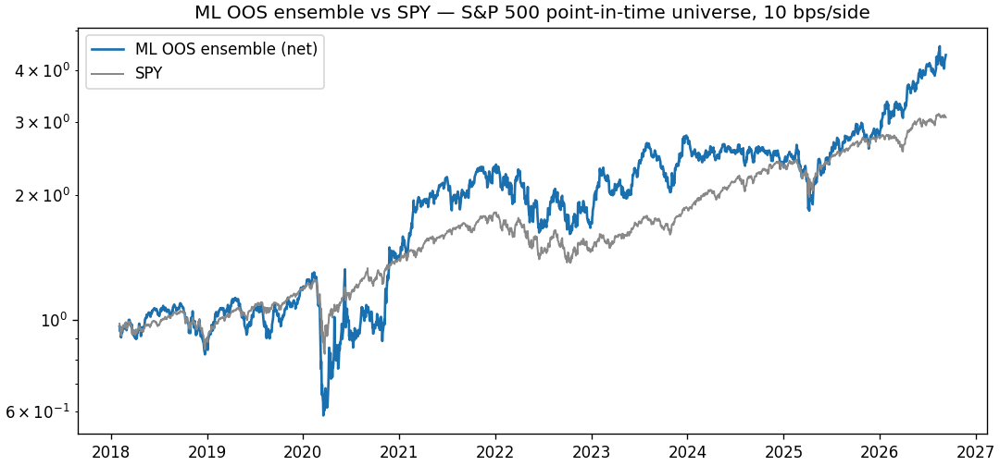
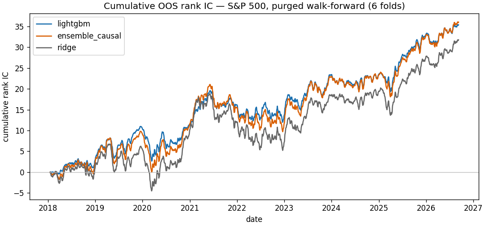
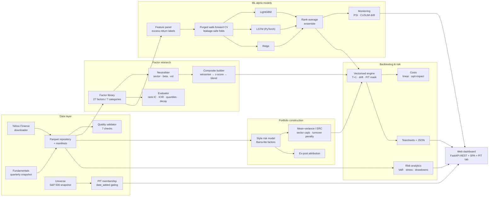

<div align="center">

# ⚒️ AlphaForge

**An end-to-end quantitative research platform for US equities — from raw market data to leakage-safe ML alpha models.**

[](https://www.python.org/)
[](LICENSE)
[](tests/)
[](https://github.com/astral-sh/ruff)
[](.github/workflows/ci.yml)

*Data pipeline → point-in-time S&P 500 universe → 27-factor library → vectorised backtester → portfolio construction & style risk model → LightGBM & LSTM alpha models → risk analytics → interactive dashboard*

[Key results](#-results-on-real-data) · [Quickstart](#-quickstart) · [Architecture](#%EF%B8%8F-architecture) · [Methodology](#-methodology-what-makes-this-different) · [FAQ](#-faq)

</div>

---

## Why this exists

Most hobby quant repos backtest a moving-average crossover on a CSV and call it a day. Real quantitative research is an **engineering discipline**: data you can trust, universes that respect *what was actually in the index at the time*, backtests that cannot peek at the future, validation that respects the fact that your labels overlap in time, and costs that are charged before you celebrate. AlphaForge is a complete, honest implementation of that workflow on **ten years of real US equity data** (full S&P 500 — 503 tickers + SPY, 2015–2026, ~1.48 M rows bundled in the repo — clone and run, no API key needed).

It is also deliberately **fast**: the whole 27-factor library computes on the 1.48 M-row panel in ~4 s, a decade-long point-in-time backtest runs in ~17 s, and the six-fold walk-forward LightGBM training finishes in minutes — because every hot path is vectorised (no per-date Python loops).

## 📊 Results on real data

*(S&P 500 universe — 503 tickers + SPY, 2015-01-02 .. 2026-09-17, ~1.48 M rows, point-in-time membership, 10 bps per-side transaction costs, T+1 execution. Full methodology below.)*

### The universe experiment: how much do sloppy backtests lie?

The same composite signal (top-5 factors by |ICIR|, monthly, long-only top 15) run through progressively more honest assumptions. **Every step removes one bias — watch the performance evaporate:**

| # | Configuration | Net CAGR | Sharpe | Max DD | Info ratio | Turnover |
|---|---|---:|---:|---:|---:|---:|
| A | Static universe — today's 503 names, as most free-data backtests do | +56.3% | 1.35 | −49.6% | +1.27 | 0.97 |
| B | **Point-in-time universe** — names join on their official addition date | **+31.0%** | **0.92** | −53.4% | +0.65 | 1.01 |
| C | B + sector & beta neutralised signal | +20.6% | 0.88 | −43.3% | +0.34 | 1.22 |
| D | C + mean-variance construction (style risk model, 30% sector caps) | +19.1% | 0.91 | −42.6% | +0.27 | 1.08 |
| E | C with square-root market impact on a $50 M book | +15.8% | 0.71 | −44.3% | +0.10 | 1.22 |
| — | SPY buy-and-hold benchmark | +13.7% | — | — | — | — |

The **A→B gap is the survivorship tax** (Sharpe 1.35 → 0.92, CAGR 56% → 31%): today's index list back-propagated into 2015 includes 188 names that were *not* in the index then, and misses every name that was removed since — free-data backtests systematically flatter themselves. The **B→C gap** shows most of the raw composite's edge was sector and beta exposure, not stock selection. **E** is what an institution trading real size would actually keep after impact costs. Full table in `results/universe_experiments.json`; every row is reproducible with `scripts/run_sp500_pipeline.py` logic via the public API.

> ⚠️ **Honesty note:** the top-5 factor *selection* uses full-sample ICIR, so rows A–E are an in-sample upper bound for factor picking. The ML pipeline below removes exactly this leak.

### Factor library — cross-sectional diagnostics (in-sample)

| Factor | Rank IC | IC IR | NW t-stat | Notes |
|---|---:|---:|---:|---|
| `ep` | **+0.033** | **+0.23** | **+5.7** | earnings yield — the classic value premium, dominant on the broad universe |
| `bb_pos` | −0.015 | −0.09 | −2.6 | Bollinger %B mean-reverts |
| `amihud` | +0.011 | +0.09 | +2.4 | Amihud illiquidity premium |
| `atr_21` | +0.021 | +0.08 | +2.2 | range-based risk |
| `vol_63` | +0.019 | +0.08 | +2.0 | |
| `sp` | +0.013 | +0.08 | +1.9 | sales yield |

All 27 factors across 7 categories (momentum, reversal, volatility, liquidity, technical, higher moments, **value**) are evaluated in `results/factor_evaluation.csv`. The three value factors come from a quarterly fundamentals snapshot (Yahoo Finance); their look-ahead limitation is disclosed in [Honest limitations](#-honest-limitations).

### ML alpha models — strictly out-of-sample (purged walk-forward, 6 folds)

*(S&P 500 panel; features are the 24 price/volume factors only — the value factors are excluded from ML on purpose, because their fundamentals snapshot is static and would leak.)*

| Model | OOS Rank IC | IC IR | NW t-stat | OOS days |
|---|---:|---:|---:|---:|
| LightGBM | **+0.016** | +0.091 | **+2.2** | 2174 |
| Rank-average ensemble | +0.017 | +0.079 | +1.9 | 2174 |
| Ridge (linear control) | +0.015 | +0.065 | +1.5 | 2174 |

Backtesting the strictly-OOS ensemble signal (monthly, long top-15, point-in-time universe, 10 bps/side):

| | Net CAGR | Sharpe | Max DD | Info ratio | Turnover |
|---|---:|---:|---:|---:|---:|
| **ML OOS ensemble (PIT)** | **+18.8%** | **0.65** | −54.9% | +0.34 | 1.25 |
| SPY benchmark | +13.7% | — | — | — | — |

Equity curve of the OOS strategy vs SPY (net of costs):



Cumulative out-of-sample rank IC of LightGBM (a straight line = persistent skill):



<details>
<summary><b>Reference: the narrower S&P 100 build (sequence models)</b></summary>

The original 104-megacap panel (bundled as `prices` in `data/cache/`) keeps the full sequence-model track record, where a small PyTorch LSTM edges out gradient boosting:

| Model | OOS Rank IC | IC IR | NW t-stat | OOS days |
|---|---:|---:|---:|---:|
| LSTM (PyTorch) | **+0.016** | +0.099 | **+2.5** | 2174 |
| Rank-average ensemble | +0.016 | +0.083 | +2.0 | 2174 |
| LightGBM | +0.012 | +0.061 | +1.5 | 2174 |

| | Net CAGR | Sharpe | Max DD | Info ratio |
|---|---:|---:|---:|---:|
| ML OOS ensemble (S&P 100) | **+23.5%** | **0.98** | −35.9% | +0.74 |
| Composite factor strategy (top-15) | +27.6% | 1.04 | −42.8% | +0.80 |

Artifacts: `results/ml_run/`, `results/backtest_ml_ensemble/`, `results/backtest_top5_long/`.

</details>

## ✨ What's inside

- **Data layer** — batched Yahoo Finance downloader with retries, Parquet repository with manifests, S&P 500 / S&P 100 universe management (bundled snapshot + live refresh from Wikipedia), a **point-in-time membership engine** (names activate on their official `date_added`, availability-gated by price data), a quarterly **fundamentals snapshot** (TTM earnings / book / sales for the value factors), incremental watermark-based panel updates with revision detection, and a 7-check data-quality validator (OHLC consistency, stale prices, coverage gaps, extreme returns...).
- **Factor library** — 27 cross-sectional factors in 7 categories (momentum, reversal, volatility, liquidity, technical, higher moments, **value**) behind a one-class registry; add your own in ~10 lines. Evaluator computes rank IC, ICIR, Newey-West t-stats, quantile spreads, turnover and IC decay — fully vectorised (29× faster than the naive per-date loop). A `Neutralizer` strips sector, beta and volatility exposure from any signal before the book is built.
- **Backtesting engine** — vectorised long/short simulation with T+1 execution lag, weight drift between rebalances, turnover measured against *drifted* weights, liquidity/price filters, position caps, optional volatility targeting, and benchmark-relative analytics (IR, alpha/beta, up/down capture). Costs are a **pluggable model**: linear per-side bps, or **square-root market impact** with configurable book size and impact coefficient.
- **Portfolio construction** — beyond equal-weight top-N: constrained **mean-variance** (SLSQP; sector caps, turnover penalty, style-risk-aware covariance) and **equal-risk-contribution** risk parity (cyclical coordinate descent), driven by a Barra-lite **style risk model** (market / size / momentum / volatility / value factors) with ex-post factor attribution of any strategy's returns.
- **ML pipeline** — feature panel builder (winsorised, z-scored, excess-return labels), **purged & embargoed walk-forward CV** (López de Prado style), LightGBM, Ridge and PyTorch LSTM models with memory-safe sequence batching, and rank-average ensembles. Incremental per-fold checkpointing for long-running models. Post-deployment **monitoring**: rolling PSI feature-drift, KS tests, and CUSUM skill-drift alerts.
- **Risk analytics** — historical & Cornish-Fisher VaR, CVaR, drawdown-episode forensics, rolling risk metrics, and stress replay of five historical crisis windows (COVID crash, 2022 rate shock, ...).
- **Reporting** — matplotlib tearsheets (equity + drawdown, rolling Sharpe, monthly heatmap, IC series, feature importances) + a full JSON metrics dump.
- **Web dashboard** — custom-built single-page app (FastAPI + hand-rolled SVG charts, zero frontend dependencies, zero CDN): factor explorer with IC decay, live backtest explorer, out-of-sample ML diagnostics, risk forensics, and a dedicated **point-in-time universe tab** (membership curve, additions by year, the bias-tax experiment table, PSI drift). Runs offline from the bundled cache; the REST API ships with auto-generated OpenAPI docs at `/docs`.
- **Engineering** — 100 unit tests pinning down the engine's exact mechanics (timing, drift, cost identities, no-lookahead, PIT membership, neutralisation, optimiser conditions, dashboard API, state-cache reentrancy), ruff-clean typed codebase, GitHub Actions CI (3.10–3.12), Docker + docker-compose, pre-commit hooks, Makefile.

## 🚀 Quickstart

```bash
# 1. clone and install (bundled 10-year S&P 500 dataset + results, ~90 MB)
git clone https://github.com/CathyKernel/alphaforge.git
cd alphaforge
pip install -e .[app]

# 2. explore the factor library on real data (~seconds)
python examples/01_factor_research.py

# 3. backtest the composite strategy and produce a tearsheet
python examples/02_backtest.py

# 4. train ML alpha models with leakage-safe validation
python examples/04_ml_pipeline.py            # add --lstm for the LSTM (CPU)

# 5. launch the web dashboard (FastAPI, offline)
alphaforge dashboard            # or: uvicorn app.server:app --port 8501
# → http://localhost:8501  (REST API docs at /docs)
#   the first request pays a one-time ~60 s lazy compute on the S&P 500
#   panel; every subsequent request is served from the in-process cache
```

No API keys, no downloads required for steps 2–5 — the repo ships the price cache. To refresh or extend the data:

```bash
python scripts/download_data.py --universe sp500 --start 2010-01-01   # full S&P 500
alphaforge universe --refresh                                          # live membership from Wikipedia
alphaforge fundamentals                                                 # quarterly snapshot for value factors
```

CLI summary: `alphaforge download | universe | factors | backtest | train | fundamentals | pipeline | dashboard`.

## 🏗️ Architecture



<details>
<summary><b>Project structure</b></summary>

```
alphaforge/
├── src/alphaforge/
│   ├── data/            # downloader, Parquet cache, universe, PIT membership,
│   │                    # fundamentals snapshot, incremental updates, quality checks
│   ├── factors/         # 27 factors + registry + IC evaluation + neutralisation
│   ├── engine/          # cost models (linear + sqrt impact), constructors,
│   │                    # vectorised backtester (T+1, drift, PIT mask)
│   ├── optimize/        # mean-variance (SLSQP) & ERC risk-parity constructors
│   ├── riskmodel/       # Barra-lite style factors + ex-post attribution
│   ├── ml/              # features, purged CV, LightGBM/LSTM/Ridge, monitoring
│   ├── risk/            # VaR, drawdown forensics, stress tests
│   ├── reporting/       # matplotlib tearsheet factory
│   └── cli.py           # alphaforge command-line interface
├── app/                 # web dashboard: FastAPI server + static SPA (no CDN)
│   ├── api.py           # JSON endpoints: factors, backtest, ML, risk, PIT universe
│   ├── server.py        # uvicorn entry point (→ :8501, /docs for OpenAPI)
│   └── static/          # hand-rolled SPA: HTML/CSS + SVG chart library
├── scripts/             # download / sp500 pipeline / ML training / incremental LSTM
├── examples/            # 4 runnable research walkthroughs
├── tests/               # 100 unit tests (engine mechanics, PIT, leakage, API)
├── data/cache/          # bundled S&P 500 (49 MB) + S&P 100 (12 MB) Parquet + fundamentals
└── results/             # pre-generated reports shown in this README
```

</details>

## 🔬 Methodology: what makes this different

<details open>
<summary><b>1. One timing convention, enforced everywhere</b></summary>

A signal computed from data through day T's close is traded at the close of day **T+1**, and earns its first return on day **T+2**. This is one day stricter than the common "IC against close(T)→close(T+h)" shortcut, and it is applied identically in the factor evaluator, the ML label builder and the backtest engine — so research numbers and backtest numbers are directly comparable. Unit tests pin the exact day-1 and day-2 PnL of a hand-checkable portfolio.

</details>

<details open>
<summary><b>2. Weights drift, and turnover is measured against drifted weights</b></summary>

Between rebalances, each position's dollar value compounds by `(1 + r_i)` exactly as a real account would. At the next rebalance, turnover — and therefore cost — is charged on the difference between the new target and the *drifted* book, not the stale target. Most simple backtesters skip this; it matters: it is the difference between "paper" and "implementable" turnover.

</details>

<details open>
<summary><b>3. Purged & embargoed walk-forward validation</b></summary>

Daily 5-day-forward labels overlap in time: a training sample dated T has a label whose realisation window extends into T+5. Naive random or standard K-fold CV lets the model's *labels* leak into the test period. AlphaForge's `PurgedWalkForwardCV`:

- trains only on data strictly **before** each test block (walk-forward, like live research),
- **purges** training samples whose label window would overlap the test block (≥ label horizon + 1 days),
- optionally **embargoes** additional days after each test block for the purged-K-fold research mode.

Every ML number reported above is produced this way: the model predicting May 2023 has never seen any data after ~November 2022.

</details>

<details open>
<summary><b>4. Costs before celebration</b></summary>

10 bps per side on total traded notional (commissions + half-spread + impact allowance — conservative for S&P 100 names), charged at every rebalance. The README tables are net. Gross numbers are in the JSON metrics for comparison.

</details>

<details open>
<summary><b>5. Data quality as a first-class citizen</b></summary>

Split/dividend-adjusted prices from Yahoo (we verified empirically that yfinance ≥ 0.2.x also split-adjusts volume, so dollar volume is split-invariant), an OHLC consistency check with tolerance for Yahoo's per-field rounding artifacts, stale-price detection, coverage-gap reporting, and liquidity filters (min $20 M average dollar volume, min $5 price) applied at backtest time. Plus an explicit **survivorship-bias treatment** (see below).

</details>

<details open>
<summary><b>6. Point-in-time universe discipline</b></summary>

A backtest may only trade names that were index members *on that date*. Membership activates on the official S&P `date_added` column and deactivates when the name's price data ends (free sources publish no removal history — the disclosed approximation). Today's 503-ticker list back-propagated to 2015 contains 188 names that joined later; without PIT the backtest buys stocks the index did not yet hold — and misses the ones it did. The dashboard's universe tab shows the resulting membership curve (315 → 503 members, mean ≈ 410) and the performance gap it causes (experiment A vs B above).

</details>

## ⚠️ Honest limitations

- **PIT additions are exact, removals are approximated**: membership activation uses the official S&P `date_added` column; deletions are approximated by end-of-price-data because free sources publish no removal history. Names that were removed from the index but kept trading remain eligible until their data ends. The universe experiment (A vs B) quantifies the residual bias — and every remaining caveat is stated here precisely because the static-universe number is the one free-data backtests usually publish.
- **Value factors use a static fundamentals snapshot**: `ep` / `bp` / `sp` are built from today's TTM earnings, book and sales values, not as-of-date values. The look-ahead is disclosed, and precisely because of it the three value factors are **excluded from the ML feature set** — all ML numbers stay strictly out-of-sample.
- **The composite table's factor selection is in-sample** (noted above). The ML pipeline is the leak-free comparison.
- **Square-root impact is a model, not a fill log**: book size and impact coefficient are configurable placeholders for what a mid-size fund would pay; borrow costs on the short leg are still ignored.
- **Past performance ≠ future performance**. This is a research framework, not investment advice.

## ❓ FAQ

**Why 503 tickers and not 500?**
The S&P 500 holds 500 *companies*, but several have two share classes listed as separate index constituents — Alphabet (GOOG + GOOGL), Berkshire (BRK-A + BRK-B) and friends — so the index tracks ~503 tickers. The bundled snapshot (503 tickers + SPY) matches the official list. Over the backtest window the *point-in-time* membership averages ≈ 410 names: the index added 188 of today's names after 2015, and free data cannot resurrect the names that were removed since.

**Why does the dashboard say the universe "grew" from 315 to 503 members?**
That is the point-in-time membership curve doing its job: in January 2015 only 315 of today's names were in the index; the rest joined later (see the additions-by-year chart on the PIT tab). A static-universe backtest silently pretends all 503 existed for the whole decade — that is the bias the experiment table quantifies.

**What exactly is the "survivorship tax"?**
Sharpe 1.35 → 0.92 and CAGR 56% → 31% for the same signal when the universe stops cheating (row A → B above). Free-data backtests that skip point-in-time membership publish the flattering number without knowing it.

**Why is the long/short book weaker than long-only?**
Shorting liquid large caps after 10 bps/side costs earns little; the low-vol/quality tilt that works long barely pays on the short side. That's a real finding, not a bug — and exactly the kind of thing an honest backtester should tell you.

**Can I add my own factor?**
Yes — subclass `Factor`, implement `compute(panel)`, decorate with `@register`; it is instantly evaluated, composable and backtestable. See `examples/03_custom_factor.py`.

**LSTM vs LightGBM — who wins, and where?**
On the S&P 100 panel the LSTM's sequence view of 40 days of factor history edges out gradient boosting (OOS ICIR 0.099 vs 0.061). On the full S&P 500 the LightGBM / Ridge pair is the workhorse (the LSTM's CPU cost on 503 tickers × 11.5 years is not worth it for a research build). Both are small, regularised models — cross-sectional equity prediction is a low-signal problem where capacity hurts. The rank-average ensemble is the most stable configuration.

**How fast is it?**
27 factors on the 1.48 M-row S&P 500 panel: ~4 s. Full 27-factor IC evaluation: ~15 s. Decade-long monthly backtest with PIT mask: ~17 s. Six-fold walk-forward LightGBM + Ridge on the S&P 500: minutes. Six-fold LSTM on S&P 100 (CPU): ~9 min. The dashboard's first request pays the lazy compute once (~60 s), then serves everything from cache.

**Is this production trading software?**
No — it is a research platform. Execution, live data feeds, portfolio accounting and compliance are explicitly out of scope.

## 🗺️ Roadmap

- [x] Point-in-time S&P 500 membership — additions exact, removals approximated (see limitations)
- [x] Sector & beta neutralisation of factor exposures (`alphaforge.factors.neutralize`)
- [x] Nonlinear (square-root) market-impact cost model (`alphaforge.engine.costs.SquareRootImpact`)
- [x] Portfolio construction: constrained mean-variance & risk parity (`alphaforge.optimize`)
- [x] Style risk model + ex-post factor attribution (`alphaforge.riskmodel`)
- [x] Model monitoring: PSI feature drift + CUSUM skill drift (`alphaforge.ml.monitoring`)
- [ ] Bayesian hyper-parameter search per fold
- [ ] Point-in-time fundamentals (as-of-date quarterly snapshots)
- [ ] Options-implied features (IV, skew, term structure)

## 🤝 Contributing

PRs welcome — see [CONTRIBUTING.md](CONTRIBUTING.md). Run `make dev test lint` before submitting.

## 📄 License

MIT — see [LICENSE](LICENSE).

**Disclaimer**: AlphaForge is a research and education tool. Nothing in this repository is investment advice, and historical backtests do not predict future returns.
